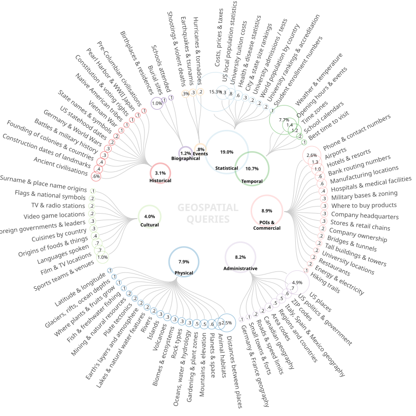

# Much of Geospatial Web Search Is Beyond Traditional GIS

**Official repository for [the paper](https://arxiv.org/abs/2605.11336) accepted as a full paper to [COSIT 2026](https://www.cosit2026.uk/)**

We apply a SetFit binary classifier and UMAP+HDBSCAN clustering to the full MS MARCO corpus of 1.01M Bing queries, identify 181,827 geospatial queries (18.0%), and derive a taxonomy of 88 categories grouped into 9 themes.

<p align="center">
	
</p>

## Repository structure

| Path | Contents |
|---|---|
| `0-ProcessData.ipynb` | Sample 5,000 queries via k-means++, weak-label with Llama 3.1, build gold dataset |
| `1-TrainClassifier.ipynb` | Train and evaluate the SetFit classifier; run on full MS MARCO |
| `2-Cluster.ipynb` | UMAP + HDBSCAN grid search, consistency checks, final clustering |
| `queries.tar.gz` | Raw MS MARCO queries (train + validation + test). This needs to be unarchived |
| `gold-dataset/` | 1,200 hand-labelled queries, split into train/val/test as 200/200/800 |
| `interim/` | Intermediate outputs (embeddings, cluster summaries) |
| `output/` | Final classifier predictions |
| `visual/` | Radial taxonomy chart source and other generated visuals |

## Reproducing the pipeline

Run the notebooks in order: `0-ProcessData` → `1-TrainClassifier` → `2-Cluster`. Each notebook documents its own dependencies.

The classifier can be used directly without retraining:

```python
from setfit import SetFitModel
model = SetFitModel.from_pretrained('ilyankou/is-geospatial-query')
model.predict(['restaurants near hyde park', 'what is greek yoghurt'])
# [1, 0]
```

## Citation

```bibtex
@misc{ilyankou2026geospatialwebsearchtraditional,
      title={Much of Geospatial Web Search Is Beyond Traditional GIS}, 
      author={Ilya Ilyankou and Stefano Cavazzi and James Haworth},
      year={2026},
      eprint={2605.11336},
      archivePrefix={arXiv},
      primaryClass={cs.IR},
      url={https://arxiv.org/abs/2605.11336}
}
```

## Licence

Code released under the MIT licence. MS MARCO queries, including the gold dataset, are subject to the [original MS MARCO terms](https://microsoft.github.io/msmarco/).